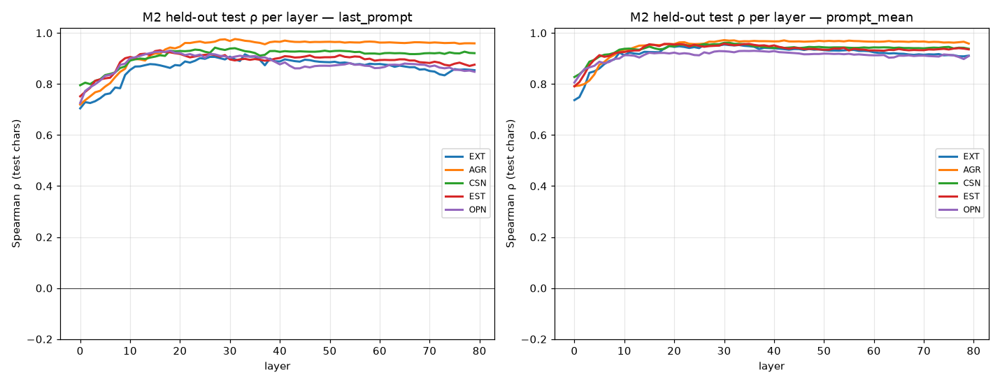

# Stage 1 report — Steerable Big Five basis (probe side + gate G1)

Model: `meta-llama/Llama-3.3-70B-Instruct` (bf16). Extraction: resid_post, all 80 layers, positions {last_prompt, prompt_mean} (prompt-only; gen_mean not collected — see deviations). Characters: 406 (Appendix B). Split: character-level 80/20, seed 0.

## Gate G1 — every trait needs a probe with test ρ>0 and adjective AUC>0.6

**G1: PASS**

| trait | position | layer | method | test ρ | test R² | adj AUC | verdict |
|---|---|---|---|---|---|---|---|
| EXT | prompt_mean | 30 | M2 | +0.955 | 0.915 | 1.000 | PASS |
| AGR | last_prompt | 31 | M2 | +0.976 | 0.944 | 1.000 | PASS |
| CSN | prompt_mean | 31 | M2 | +0.962 | 0.928 | 1.000 | PASS |
| EST | prompt_mean | 30 | M2 | +0.958 | 0.907 | 1.000 | PASS |
| OPN | prompt_mean | 36 | M2 | +0.930 | 0.837 | 1.000 | PASS |

Probe-optimal selection maximises ½(test ρ + adjective AUC) over (layer × position × method).

## §3.5 Basis quality — cross-talk (cosine of the 5 probe-optimal directions)

max |cos| = **0.112** (flag threshold 0.40 — none flagged). This is the H5 specificity baseline; the causal specificity matrix is a §3.6 steering result.

| pair | cos |
|---|---|
| EXT-AGR | +0.016 |
| EXT-CSN | -0.078 |
| EXT-EST | +0.071 |
| EXT-OPN | +0.044 |
| AGR-CSN | -0.027 |
| AGR-EST | -0.008 |
| AGR-OPN | -0.004 |
| CSN-EST | +0.038 |
| CSN-OPN | +0.026 |
| EST-OPN | +0.112 |

## §3.3 Method comparison (H2 preview — probe side only)

H2 (within-score averaging helps *probing* but hurts *steering*) needs the §3.6 steering stage for its second half. On the probe side, the probe-optimal method for **all five traits is M2** (per-sample ridge), beating M1 (the paper's within-score-averaging method) at every trait:

| trait | M1 ρ | M2 ρ | M3 ρ | probe-optimal |
|---|---|---|---|---|
| EXT | +0.62 | +0.95 | +0.81 | M2 |
| AGR | +0.89 | +0.98 | +0.90 | M2 |
| CSN | +0.80 | +0.96 | +0.80 | M2 |
| EST | +0.77 | +0.96 | +0.76 | M2 |
| OPN | +0.51 | +0.93 | +0.75 | M2 |

## §9.1 Summary alignment layer

Mean test-ρ across traits peaks at **prompt_mean L30** (mean ρ = 0.955). Selected probe layers cluster at L30–36, consistent with the parent paper's mid-to-late-layer peak.

## Deviations from the plan (recorded for the manifest)

- **Stimuli source.** `plastic-labs/personality-steering` is 404 (HF dataset 401). All stimuli harvested from arXiv 2512.17639 instead (chars=Appendix B parses to exactly 406; IPIP-50=Table 2; Alpaca=Appendix D). Adjectives substituted with the Saucier (1994) Mini-Markers (paper's list is an image).
- **Positions.** Character self_descriptions are ~3.2k tokens; generating for gen_mean ran at 370/hr (~11h) and hit the 80GiB ceiling. Collected prompt-only (last_prompt + prompt_mean) in one forward pass. prompt_mean is the paper's own probe-optimal position, so gen_mean is captured-but-never-selected there; reversible.
- **Split.** Literal joint-quintile stratification over 5 traits drains the test set to ~11 characters (5^5 singleton cells). Stratified on the summed-z quintile instead → 80 test chars.
- **Index format.** JSON not parquet (pandas/pyarrow absent). Same columns.

## Pending (post-G1, not in this checkpoint)

- §3.6 steering derivation + evaluation (S0/S1/S2 × layer bands; forced-choice primary): decides **H1** (steerability under stronger intervention), the second half of **H2** (steering-optimal vs probe-optimal), and **H5** (causal specificity matrix).
- Stage 2+ (persona space / Assistant-Axis decomposition, H3/H4) — reuses the published axis.
