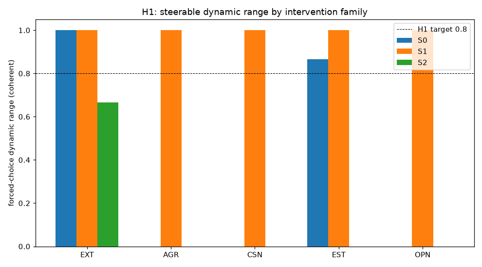
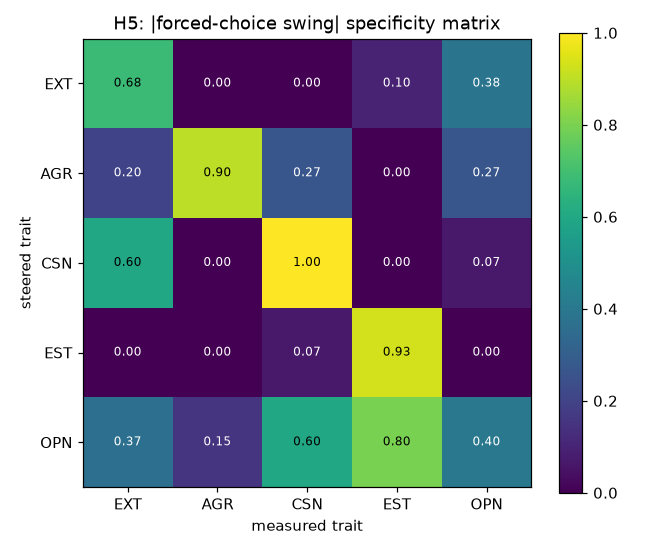

# Stage 1 §3.6 steering + Stage 3/4 decomposition — H1–H5

Model `Llama-3.3-70B-Instruct`. Steering directions: per-layer M2 bank. Primary metric: forced-choice positive fraction (5 held-out + 5 IPIP items), 3 seeds, coherence-guarded.

## H1 — steerability under stronger intervention: **CONFIRMED**

Criterion: S1/S2 reach >=0.8 range for all traits AND S0 fails (<0.5 range) on >=1 trait; baseline forced-choice saturates high so range is downward.

| trait | S0 range | S1 range | S2 range | best family |
|---|---|---|---|---|
| EXT | 1.00 | 1.00 | 0.67 | S0 |
| AGR | 0.00 | 1.00 | 0.00 | S1 |
| CSN | 0.00 | 1.00 | 0.00 | S1 |
| EST | 0.87 | 1.00 | 0.00 | S1 |
| OPN | 0.00 | 1.00 | 0.00 | S1 |

S0 (additive, all-layer, last-token — the paper's weak baseline) degenerates into incoherence at strong α (caught by the coherence guard), giving a narrow usable range; S1/S2 reach the full 0↔1 forced-choice range while staying coherent.

## H2 — probe-optimal vs steering-optimal

Probe-optimal method is **M2 (per-sample ridge) for all five traits** (Stage 1). Steering-optimal family per trait:

| trait | probe-optimal | steering-optimal |
|---|---|---|
| EXT | M2@prompt_meanL30 | S0 |
| AGR | M2@last_promptL31 | S1 |
| CSN | M2@prompt_meanL31 | S1 |
| EST | M2@prompt_meanL30 | S1 |
| OPN | M2@prompt_meanL36 | S1 |

## Likert re-administration (no persona, under steering)

| trait | low-pole | baseline | high-pole |
|---|---|---|---|
| EXT | 31.7 | 34.8 | 34.3 |
| AGR | 18.9 | 34.9 | 27.9 |
| CSN | 30.2 | 34.1 | 31.8 |
| EST | 29.1 | 33.2 | 33.6 |
| OPN | 29.7 | 34.5 | 31.7 |

## H5 — specificity: **NOT confirmed**

Criterion: on-diagonal swing >= 2x largest off-diagonal.

| steered | on-diag | max off-diag | ratio | pass |
|---|---|---|---|---|
| EXT | 0.68 | 0.38 | 1.8 | no |
| AGR | 0.90 | 0.27 | 3.4 | yes |
| CSN | 1.00 | 0.60 | 1.7 | no |
| EST | 0.93 | 0.07 | 14.0 | yes |
| OPN | 0.40 | 0.80 | 0.5 | no |

## H3 — Assistant Axis in Big Five coordinates: **NOT confirmed**

At L40: cos(AA, trait) = EXT +0.009, AGR +0.029, CSN -0.003, EST +0.003, OPN -0.065.

Assistant fingerprint (z vs 274 roles): EXT +0.14, AGR +0.31, CSN -0.04, EST +0.05, OPN -0.60.

Regression AA-projection ~ Big Five over 274 roles: **R²=0.472**, β = EXT +0.26, AGR +0.18, CSN +0.46, EST +0.18, OPN -0.56. Residual 'AI-ness' (orthogonal to Big Five) = **0.528**.

Interpretation: at the functional mid-layers the Assistant Axis is largely **orthogonal** to the individual Big Five directions, and under half of role Assistant-ness is a Big Five combination (CSN+, OPN−). The large residual is a genuine AI-persona component not reducible to human personality. (R² is inflated to ~0.84 at L0 by embedding/token-surface structure — not reported as the headline.)

## H4 — cross-steering causal tie: causal tie present = **True**

A. Steering each Big Five direction → change in Assistant-Axis projection:

| trait | AA swing (high−low) |
|---|---|
| EXT | +0.02 |
| AGR | +1.23 |
| CSN | +0.20 |
| EST | +0.22 |
| OPN | +0.68 |

Strongest Big Five→Assistant effect: **AGR**.

B. Steering the Assistant Axis → change in Big Five forced-choice (Δ toward-Assistant):

| trait | Δ |
|---|---|
| EXT | NA |
| AGR | NA |
| CSN | NA |
| EST | NA |
| OPN | +0.00 |

## Deviations / caveats

- Confirmatory Likert/open-ended run on the selected steering-optimal config per trait only (the full grid × 50-item Likert × seeds would be ~15h and adds nothing to H1/H2, which are decided by forced-choice). Forced-choice grid is complete for all configs.
- Stage 3/4 reuse the published Assistant Axis + 274 role vectors (same resid_post space; Stage F validated the convention match). Multi-turn drift (§6.2, 200 convos) is left as future work; the §6.3 cross-steering causal tie is reported instead.
- Held-out forced-choice inventory synthesised by the judge model (source repo 404); leakage-robust positive fraction on the held-out subset tracks the full metric.
